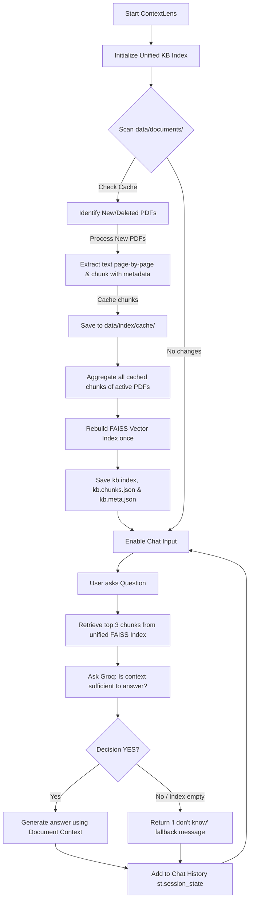

# ContextLens 🔍 — Website FAQ / Support Chatbot (RAG)

ContextLens is a modern, lightweight Website FAQ / Support Chatbot that uses **Retrieval-Augmented Generation (RAG)**. Built entirely in Python using **Streamlit** and **Groq**, it behaves like a chatbot for answering queries based on uploaded company documentation.

---

## 🚀 Key Features

- **Visitor / Admin Mode Selection**: A simple toggle in the sidebar switches the interface between **Visitor Mode** (clean chatbot support experience) and **Admin Mode** (full document management dashboard).
- **Admin Dashboard**: Organizes uploads, uploaded file statuses, statistics, and index rebuild workflows inside clean Streamlit expanders.
- **Multi-Document Support**: Upload and manage multiple PDF files simultaneously, consolidating their contents into a single unified knowledge base.
- **Knowledge Base Management**: Add and delete documents in real-time, displaying file names, sizes, and rebuilding indices automatically.
- **FAISS Vector Search**: Fast similarity search over all documents in the knowledge base using `IndexFlatIP` indexing.
- **SentenceTransformer Embeddings**: High-quality dense vector representations using `all-MiniLM-L6-v2`.
- **Groq LLM Integration**: Fast inference with the Groq client (`openai/gpt-oss-20b` or custom models).
- **Intelligent RAG Routing**: Instead of relying purely on brittle thresholds, ContextLens uses an LLM-based sufficiency auditor to evaluate context before answering.
- **Support Chatbot Fallback**: Returns a friendly "I don't know" message if the document context is insufficient, rather than guessing or searching the web.
- **Chat History**: Preserves conversation history locally across session reruns using `st.session_state`.
- **Debug Mode**: Toggleable metrics panel in the sidebar showing document analysis stats, top search hits, scores, and execution times (embedding, search, routing, and Groq).

---

## 🛠️ Tech Stack
- **Frontend**: [Streamlit](https://streamlit.io/) for a clean, interactive user experience.
- **LLM API**: [Groq SDK](https://github.com/groq/groq-python) (running `openai/gpt-oss-20b` or custom models).
- **Embeddings**: [sentence-transformers](https://huggingface.co/sentence-transformers) (`all-MiniLM-L6-v2` model, cached locally).
- **Vector DB**: [faiss-cpu](https://github.com/facebookresearch/faiss) for efficient dense vector similarity search.
- **PDF Extraction**: [pypdf](https://pypi.org/project/pypdf/) for reading and cleaning document text.

---

## 🏗️ Project Architecture

```text
ContextLens/
├── app.py           # Streamlit application (UI layout, state management, chat interaction)
├── rag.py           # Core RAG pipeline (index build, save/load persistence, Groq API client)
├── utils.py         # PDF text extraction and text chunking
├── requirements.txt # Project Python package dependencies
├── .env.example     # Configuration template for API keys and models
├── README.md        # System documentation and instructions
└── data/
    ├── documents/   # Persistent folder where uploaded PDF files are stored
    └── index/       # Index files directory
        ├── kb.index # Unified FAISS index containing vectors of all files
        ├── kb.chunks.json # Unified chunks list containing text and metadata
        ├── kb.meta.json # Knowledge Base metadata (docs count, chunks count, last indexed)
        └── cache/   # Cached chunk JSONs for individual PDF files (for incremental indexing)
```

---

## 🔄 Streamlit Workflow



---

## ⚙️ How It Works

1. **Upload PDF & Document Verification**: Admin uploads PDF documents via the **Admin Dashboard** (expanders). If a duplicate is uploaded, the dashboard warns the admin and skips it unless the "Overwrite existing files" option is checked. All PDFs are saved under `data/documents/`.
2. **Build Embeddings & Persistence**: The app parses the document text, splits it into overlapping 500-character chunks, embeds them using `all-MiniLM-L6-v2`, builds a FAISS index, and persists both index and chunks to `data/index/` for sub-second retrieval on future sessions.
3. **FAISS Retrieval**: When a query is asked, the system retrieves the **top 3** most similar chunks from the FAISS index (using a threshold of `-1.0` to ensure candidates are retrieved).
4. **LLM Context Evaluation**: The top 3 chunks are sent to the Groq LLM with an audit instruction. The LLM performs a sufficiency analysis and answers either `YES` or `NO` on whether the context is sufficient to answer the question.
5. **Answer Generation**:
    - If the audit returns **`YES`**, the LLM answers the query based **only** on the document chunks.
    - If the audit returns **`NO`** (or the index is empty), the chatbot returns: *"I don't know. I couldn't find that information in the uploaded company documentation."*

### 🛠️ Admin Dashboard Workflow
- **Upload**: Admin can select multiple PDF files, toggle overwrite capability, and see real-time upload progress.
- **Delete**: Admin can choose a specific file to delete. Deleting a document automatically triggers a background FAISS index rebuild.
- **Rebuild**: A manual button allows regenerating vector embeddings and rebuilding the unified FAISS database.

---

## 📦 Setup and Installation

### 1. Configure the Virtual Environment
```bash
python -m venv venv
# On Windows (PowerShell):
.\venv\Scripts\Activate.ps1
# On Linux/macOS:
source venv/bin/activate
```

### 2. Install Dependencies
```bash
pip install -r requirements.txt
```

### 3. Setup Configuration Variables
1. Copy `.env.example` to `.env`:
   ```bash
   copy .env.example .env
   ```
2. Fill in your Groq API key and preferred model:
   ```env
   GROQ_API_KEY=gsk_your_actual_key_here
   GROQ_MODEL=openai/gpt-oss-20b
   SIMILARITY_THRESHOLD=0.15
   ```

---

## ⚙️ Environment Variables

ContextLens supports configuration via [`.env`](file:///C:/Projects/DocQuery-AI/.env):
- `GROQ_API_KEY`: API credential key from console.groq.com.
- `GROQ_MODEL`: Model Identifier (defaults to `openai/gpt-oss-20b`).
- `SIMILARITY_THRESHOLD`: The baseline similarity threshold for document chunks (defaults to `0.15`).

---

## 🏃 Running the Application

Launch the Streamlit web interface:
```bash
streamlit run app.py
```

Open `http://localhost:8501` in your browser.

---

## 🔌 Embeddable Chat Widget & Demo Website

ContextLens can be embedded as a floating support chat widget on any website. 

### 1. How to Run the Demo Site
1. Ensure your Streamlit app is running on port 8501 (`http://localhost:8501`).
2. Open the [demo_site.html](file:///C:/Projects/DocQuery-AI/demo_site.html) file directly in any web browser.
3. Click the floating blue chat button in the bottom-right corner to open and test the support chatbot.

### 2. How to Embed the Widget on Your Site
Add the following HTML code snippet to your website (preferably right before the closing `</body>` tag):

```html
<!-- Floating Chat Widget Container -->
<div id="chat-widget-container" style="position: fixed; bottom: 25px; right: 25px; z-index: 999999;">
    <!-- Chat Window Container -->
    <div id="chat-widget-window" style="position: absolute; bottom: 75px; right: 0; width: 380px; height: 600px; max-height: calc(100vh - 120px); background-color: white; border-radius: 16px; box-shadow: 0 10px 30px rgba(0, 0, 0, 0.16); overflow: hidden; border: 1px solid rgba(0, 0, 0, 0.08); opacity: 0; transform: translateY(30px) scale(0.95); transform-origin: bottom right; pointer-events: none; transition: opacity 0.3s cubic-bezier(0.16, 1, 0.3, 1), transform 0.3s cubic-bezier(0.16, 1, 0.3, 1);">
        <iframe src="http://localhost:8501/?embed=true&widget=true" style="width: 100%; height: 100%; border: none; display: block;" title="Support Chatbot"></iframe>
    </div>
    <!-- Launcher Button -->
    <button id="chat-widget-launcher" onclick="toggleChatWidget()" style="width: 60px; height: 60px; border-radius: 50%; background-color: #007bff; color: white; border: none; outline: none; cursor: pointer; box-shadow: 0 4px 15px rgba(0, 123, 255, 0.35); display: flex; align-items: center; justify-content: center; transition: transform 0.25s ease, background-color 0.25s ease;">
        <span id="chat-widget-launcher-icon" style="font-size: 26px; transition: transform 0.25s ease;">💬</span>
    </button>
</div>

<script>
    function toggleChatWidget() {
        const container = document.getElementById('chat-widget-container');
        const windowDiv = document.getElementById('chat-widget-window');
        const launcher = document.getElementById('chat-widget-launcher');
        const icon = document.getElementById('chat-widget-launcher-icon');
        
        if (container.classList.contains('chat-widget-open')) {
            container.classList.remove('chat-widget-open');
            windowDiv.style.opacity = '0';
            windowDiv.style.transform = 'translateY(30px) scale(0.95)';
            windowDiv.style.pointerEvents = 'none';
            launcher.style.backgroundColor = '#007bff';
            icon.innerText = '💬';
        } else {
            container.classList.add('chat-widget-open');
            windowDiv.style.opacity = '1';
            windowDiv.style.transform = 'translateY(0) scale(1)';
            windowDiv.style.pointerEvents = 'auto';
            launcher.style.backgroundColor = '#f43f5e';
            icon.innerText = '✕';
        }
    }
</script>
```

### 3. Widget Customizations
By appending `?widget=true` to the Streamlit URL:
- The sidebar, top headers, MainMenu, and footer are completely hidden.
- The chatbot defaults to **Visitor Mode**, preventing visitors from accessing the **Admin Dashboard**.
- A custom clean support header is displayed at the top of the chat area.

---

## 📸 User Interface Mockups

*Below are placeholder regions representing ContextLens in action:*

### 1. Mode Toggle (Sidebar)
`[=== Sidebar: 👤 Mode (Visitor / Admin) Radio Buttons ===]`

### 2. Admin Dashboard (Admin Mode Sidebar)
`[=== Expanders: 📂 Upload Documents | 📚 Uploaded Documents | 📊 Knowledge Base Stats | 🛠️ Maintenance ===]`

### 2. Interactive Document QA (Document Source)
`[=== Chat Bubble (User): "What is FAISS?" ===]`  
`[=== Chat Bubble (AI): "FAISS is a library for similarity search..." ===]`  
`[=== Source Tag: 📄 Document | Score: 0.2084 ===]`

### 3. Chatbot Fallback (No Document Source)
`[=== Chat Bubble (User): "Who is the Prime Minister of Canada?" ===]`  
`[=== Chat Bubble (AI): "I don't know. I couldn't find that information in the uploaded company documentation." ===]`

### 4. Floating Chat Widget (Visitor Mode Web Embedding)
`[=== Floating support-chat launcher widget (💬) fixed to the bottom-right corner of demo_site.html. Once clicked, it opens a clean rounded chat window embedding the Streamlit RAG bot ===]`

---

## 🔮 Future Improvements
- **Custom System Instructions**: Let users configure system prompts directly in the Streamlit UI.
- **Document Formats**: Extend support to include `.txt`, `.docx`, and `.csv` files.
- **Offline Mode**: Add support for local vector search and LLMs via Ollama.

---

## 📄 License
Distributed under the MIT License. See `LICENSE` for more information.
