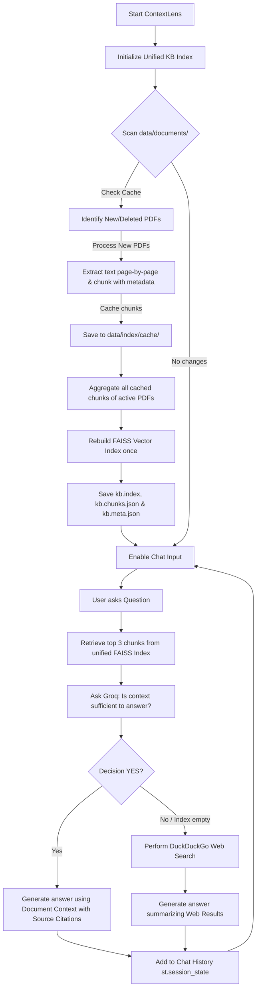

# ContextLens 🔍 — Document QA Assistant (RAG)

ContextLens is a modern, lightweight Document Question Answering Assistant that uses **Retrieval-Augmented Generation (RAG)** with a **Web Search Fallback**. Built entirely in Python using **Streamlit** and **Groq**, it behaves like a lightweight, local ChatGPT for your documents.

---

## 🚀 Key Features

- **Streamlit Interface**: Clean, ChatGPT-like conversation layout built for GitHub portfolio presentation.
- **PDF Upload & Storage**: Upload files via `st.file_uploader` and store them persistently under `data/documents/`.
- **FAISS Vector Search**: Fast similarity search using `IndexFlatIP` indexing.
- **SentenceTransformer Embeddings**: High-quality dense vector representations using `all-MiniLM-L6-v2`.
- **Groq LLM Integration**: Fast inference with the Groq client (`openai/gpt-oss-20b` or custom models).
- **Intelligent RAG Routing**: Instead of relying purely on brittle thresholds, ContextLens uses an LLM-based sufficiency auditor to evaluate context before answering.
- **Intelligent Web Fallback**: Uses a time-bounded (10s) DuckDuckGo search fallback if the document does not contain the answer.
- **Chat History**: Preserves conversation history locally across session reruns using `st.session_state`.
- **Debug Mode**: Toggleable metrics panel in the sidebar showing document analysis stats, top search hits, scores, and execution times (embedding, search, routing, Groq, and web search).

---

## 🛠️ Tech Stack
- **Frontend**: [Streamlit](https://streamlit.io/) for a clean, interactive user experience.
- **LLM API**: [Groq SDK](https://github.com/groq/groq-python) (running `openai/gpt-oss-20b` or custom models).
- **Embeddings**: [sentence-transformers](https://huggingface.co/sentence-transformers) (`all-MiniLM-L6-v2` model, cached locally).
- **Vector DB**: [faiss-cpu](https://github.com/facebookresearch/faiss) for efficient dense vector similarity search.
- **PDF Extraction**: [pypdf](https://pypi.org/project/pypdf/) for reading and cleaning document text.
- **Fallback Search**: [duckduckgo-search](https://pypi.org/project/duckduckgo-search/) for fallback queries.

---

## 🏗️ Project Architecture

```text
ContextLens/
├── app.py           # Streamlit application (UI layout, state management, chat interaction)
├── rag.py           # Core RAG pipeline (index build, save/load persistence, Groq API client)
├── web_search.py    # Fallback search query executor using DuckDuckGo
├── utils.py         # PDF text extraction, text chunking, and metadata parsing
├── requirements.txt # Project Python package dependencies
├── .env.example     # Configuration template for API keys and models
├── README.md        # System documentation and instructions
└── data/
    ├── documents/   # Persistent folder where uploaded PDF files are stored
    └── index/       # Index files directory
        ├── kb.index # Unified FAISS index containing vectors of all files
        ├── kb.chunks.json # Unified chunks list containing text and metadata
        ├── kb.meta.json # Knowledge Base metadata (docs count, chunks count, last indexed)
        └── cache/   # Cached chunk JSONs for individual PDF files (for incremental indexing)
```

---

## 🔄 Streamlit Workflow



---

## ⚙️ How It Works (Knowledge Base & Admin Workflow)

### 1. Multi-Document Support & Persistent Storage
- **Multiple PDF Upload**: The admin can upload one or multiple PDF documents concurrently via the Streamlit file uploader. Uploaded files are saved persistently inside the `data/documents/` directory.
- **Duplicate Prevention**: If a document with the same filename is uploaded, ContextLens skips it by default to avoid duplicate chunking and embedding, unless the admin explicitly toggles the **"Overwrite existing files"** checkbox in the sidebar.

### 2. Knowledge Base Workflow (Incremental Indexing)
- **Incremental Chunk Caching**: When documents are uploaded, the system parses the PDFs page-by-page. To save computational time and API usage, ContextLens stores the extracted chunks and page metadata for each document in `data/index/cache/<filename>.chunks.json`. 
- **Metadata Association**: Each text chunk retains rich metadata, including its parent `filename`, document-level `chunk_id`, and `page` number (if available).
- **Single FAISS Rebuild**: When new documents are uploaded or removed, only the new files are processed. After processing, all cached chunks are consolidated into a single list, and the unified FAISS index (`kb.index`) is rebuilt once.

### 3. Admin Actions (Delete & Rebuild)
- **Document Deletion**: Admins can remove any document from the knowledge base by clicking the trash icon (🗑️) next to it in the sidebar list. When clicked, ContextLens deletes the PDF from `data/documents/`, deletes its cached chunks, and rebuilds the FAISS index automatically.
- **Force Rebuild**: The **"Rebuild Knowledge Base"** button in the sidebar forces the application to clear all caches, re-extract text, re-chunk, and regenerate all embeddings for the entire collection of documents from scratch.
- **Real-time Metrics**: The sidebar provides a real-time status card showing the **Total Documents**, **Total Chunks**, and **Last Indexed Time**.

### 4. Search & Source Citation
- **Unified Retrieval**: When a query is entered, the chatbot performs a similarity search across all documents in the unified index.
- **Source Citation**: Every response sourced from the documents displays a detailed citation specifying:
  ```text
  Source:
  Document: FAQ.pdf
  Chunk: 14
  Page: 3
  ```
  If page numbers are not available for the source document, that field is dynamically omitted.
- **Extended Debug Mode**: Enabling **Debug Mode** displays stats about the active index (document count, list of indexed filenames, total chunks) along with details of the retrieved documents, similarity scores, and retrieved chunk IDs for the last query.

---

## 📦 Setup and Installation

### 1. Configure the Virtual Environment
```bash
python -m venv venv
# On Windows (PowerShell):
.\venv\Scripts\Activate.ps1
# On Linux/macOS:
source venv/bin/activate
```

### 2. Install Dependencies
```bash
pip install -r requirements.txt
```

### 3. Setup Configuration Variables
1. Copy `.env.example` to `.env`:
   ```bash
   copy .env.example .env
   ```
2. Fill in your Groq API key and preferred model:
   ```env
   GROQ_API_KEY=gsk_your_actual_key_here
   GROQ_MODEL=openai/gpt-oss-20b
   SIMILARITY_THRESHOLD=0.15
   ```

---

## ⚙️ Environment Variables

ContextLens supports configuration via [`.env`](file:///C:/Projects/DocQuery-AI/.env):
- `GROQ_API_KEY`: API credential key from console.groq.com.
- `GROQ_MODEL`: Model Identifier (defaults to `openai/gpt-oss-20b`).
- `SIMILARITY_THRESHOLD`: The baseline similarity threshold for document chunks (defaults to `0.15`).

---

## 🏃 Running the Application

Launch the Streamlit web interface:
```bash
streamlit run app.py
```

Open `http://localhost:8501` in your browser.

---

## 📸 User Interface Mockups

*Below are placeholder regions representing ContextLens in action:*

### 1. Document Upload & Selection (Sidebar)
`[=== Sidebar: Upload a PDF / Dropdown List of Available PDFs ===]`

### 2. Interactive Document QA (Document Source)
`[=== Chat Bubble (User): "What is FAISS?" ===]`  
`[=== Chat Bubble (AI): "FAISS is a library for similarity search..." ===]`  
`[=== Source Tag: 📄 Document | Score: 0.2084 ===]`

### 3. Web Search Fallback (Web Source)
`[=== Chat Bubble (User): "Who is the Prime Minister of Canada?" ===]`  
`[=== Info Banner: Context insufficient. Fallback to Web Search... ===]`  
`[=== Chat Bubble (AI): "The Prime Minister of Canada is Mark Carney..." ===]`  
`[=== Source Tag: 🌐 Web Search | Score: 0.0914 ===]`

---

## 🔮 Future Improvements
- **Custom System Instructions**: Let users configure system prompts directly in the Streamlit UI.
- **Document Formats**: Extend support to include `.txt`, `.docx`, and `.csv` files.
- **Offline Mode**: Add support for local vector search and LLMs via Ollama.

---

## 📄 License
Distributed under the MIT License. See `LICENSE` for more information.
