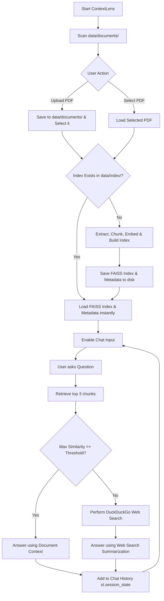

# ContextLens 🔍 — Document QA Assistant (RAG)

ContextLens is a modern, lightweight Document Question Answering Assistant that uses **Retrieval-Augmented Generation (RAG)** with a **Web Search Fallback**. Built entirely in Python using **Streamlit** and **Groq**, it behaves like a lightweight, local ChatGPT for your documents.

---

## 🚀 Key Features

1. **Modern Chat UI**: Implements a ChatGPT-like conversation interface with persistent message history using `st.session_state`.
2. **Sidebar Document Hub**: Automatically scans `data/documents/` on startup. Users can upload a new PDF or instantly select previously uploaded ones.
3. **Smart Persistence & Index Caching**: Generates embeddings and builds a FAISS similarity search index once per document. Saves the index and metadata into `data/index/` to prevent redundant work on subsequent loads.
4. **Smart Threshold Routing**: 
   - If the similarity score is **above the configured threshold** (default: `0.20`), the LLM answers using **only** document context (labeled `📄 Document`).
   - If the score is **below the threshold**, it triggers a live web search using DuckDuckGo, and the LLM summarizes those search results (labeled `🌐 Web Search`).
5. **Ultra-Fast & Private Inference**: Uses the fast Groq SDK API to generate context-grounded completions.
6. **Debug Mode**: A toggleable metrics sidebar panel showing active document chunk details, similarity scores, and execution times (embedding, search, LLM, and web).


---

## 🛠️ Tech Stack
- **Frontend**: [Streamlit](https://streamlit.io/) for a clean, interactive user experience.
- **LLM API**: [Groq SDK](https://github.com/groq/groq-python) (running `openai/gpt-oss-20b` or custom models).
- **Embeddings**: [sentence-transformers](https://huggingface.co/sentence-transformers) (`all-MiniLM-L6-v2` model, cached locally).
- **Vector DB**: [faiss-cpu](https://github.com/facebookresearch/faiss) for efficient dense vector similarity search.
- **PDF Extraction**: [pypdf](https://pypi.org/project/pypdf/) for reading and cleaning document text.
- **Fallback Search**: [duckduckgo-search](https://pypi.org/project/duckduckgo-search/) for fallback queries.

---

## 🏗️ Project Architecture

```text
DocQuery-AI/
├── app.py           # Streamlit application (UI layout, state management, chat interaction)
├── rag.py           # Core RAG pipeline (index build, save/load persistence, Groq API client)
├── web_search.py    # Fallback search query executor using DuckDuckGo
├── utils.py         # Text chunking, PDF loading, and system helpers
├── requirements.txt # Project Python package dependencies
├── .env.example     # Configuration template for API keys and models
└── README.md        # System documentation and instructions
```

---

## 🔄 Streamlit Workflow



---

## 📦 Setup and Installation

### 1. Configure the Virtual Environment
```bash
python -m venv venv
# On Windows (PowerShell):
.\venv\Scripts\Activate.ps1
# On Linux/macOS:
source venv/bin/activate
```

### 2. Install Dependencies
```bash
pip install -r requirements.txt
```

### 3. Setup Configuration Variables
1. Copy `.env.example` to `.env`:
   ```bash
   copy .env.example .env
   ```
2. Fill in your Groq API key and preferred model:
   ```env
   GROQ_API_KEY=gsk_your_actual_key_here
   GROQ_MODEL=openai/gpt-oss-20b
   SIMILARITY_THRESHOLD=0.20
   ```

---

## 🏃 Running the Application

Launch the Streamlit web interface:
```bash
streamlit run app.py
```

Open `http://localhost:8501` in your browser.

---

## 📸 User Interface Mockups

*Below are placeholder regions representing ContextLens in action:*

### 1. Document Upload & Selection (Sidebar)
`[=== Sidebar: Upload a PDF / Dropdown List of Available PDFs ===]`

### 2. Interactive Document QA (Document Source)
`[=== Chat Bubble (User): "What is FAISS?" ===]`  
`[=== Chat Bubble (AI): "FAISS is a library for similarity search..." ===]`  
`[=== Source Tag: 📄 Document | Score: 0.2084 ===]`

### 3. Web Search Fallback (Web Source)
`[=== Chat Bubble (User): "Who is the Prime Minister of Canada?" ===]`  
`[=== Info Banner: Similarity score below threshold. Fallback to Web Search... ===]`  
`[=== Chat Bubble (AI): "The Prime Minister of Canada is Mark Carney..." ===]`  
`[=== Source Tag: 🌐 Web Search | Score: 0.1050 ===]`
